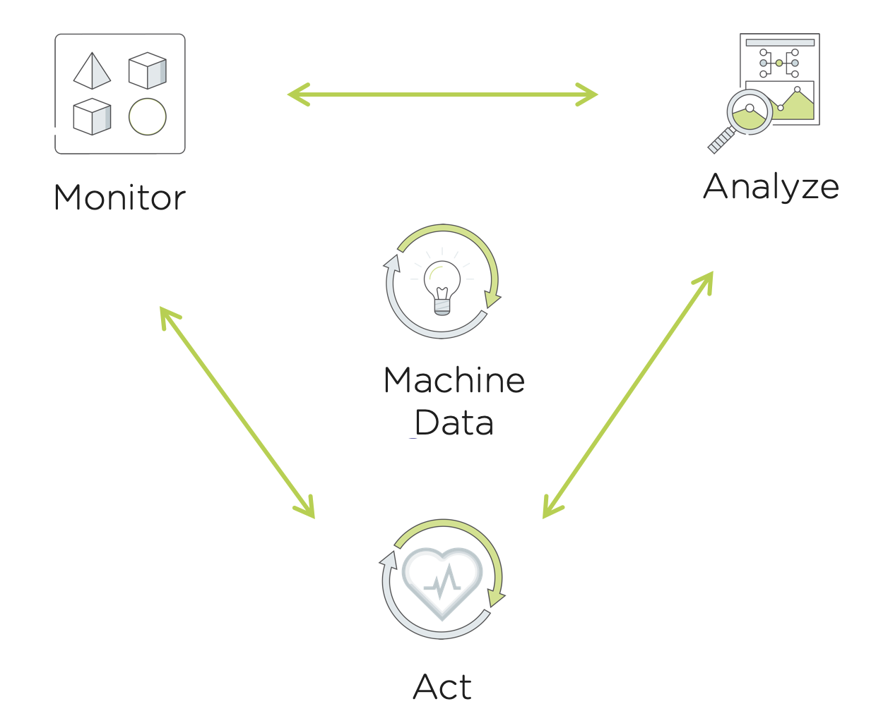

------------------------------------------
Application Monitoring with Prism Ultimate
------------------------------------------

Prism Pro brings smart automation to our customer’s daily IT operations. The typical operations workflow is a continuous cycle of monitoring, analyzing and taking action where necessary. Prism Pro mirrors traditional IT Admin's workflows to improve operations efficiency. With Prism Pro, IT Admins are able to connect insights from machine data to automate this typical flow using the power of the machine learning engine X-FIT and the X-Play automation engine.

**ADD Prism Ultimate/SQL Monitoring note here.** 

In this lab you will learn how Prism Ultimate can help IT Admins monitor, analyze and automatically act when a SQL Server's performance is imapcted.

Lab Setup
+++++++++

#. Open your **Prism Central** and navigate to the **VMs** page. Note down the IP Address of the **PrismOpsLabUtilityServer**. You will need to access this IP Address throughout this lab.

   .. figure:: images/init1.png

#. Open a new tab in the browser, and navigate to http://`<PrismOpsLabUtilityServer_IP_ADDRESS>`/alerts [example http://10.38.17.12/alerts]. It is possible you may need to log into the VM if you are the first one to use it. Just fill out the **Prism Central IP**, **Username** and **Password** and click **Login**.

   .. figure:: images/init2.png

#. Once you have landed on the alerts page, leave the tab open. It will be used in a later portion of this lab.

   .. figure:: images/init2b.png

#. In a separate tab, navigate to http://`<PrismOpsLabUtilityServer_IP_ADDRESS>`/ to complete the lab from [example http://10.38.17.12/]. Use the UI at this URL to complete the lab.

   .. figure:: images/init3.png

SQL Server Monitoring with Prism Ultimate
+++++++++++++++++++++++++++++++++++++++++++

Prism Ultimate use ...............................

#. Go to Integrations from the Prism Central home page

   **ADD IMAGE**

#. Click **Get Started** to start setting up a monitoring integration. 

   .. figure:: images/appmonitoring1.png

#. Click configure instances

   .. figure:: images/appmonitoring2.png

#. Choose Microsoft SQL Server from the dropdown(the other option being vCenter) and click on enable Nutaix collector to start external metrics

   .. figure:: images/appmonitoring3.png

#. Choose your SQL VM IP from the dropdown list 

   .. figure:: images/appmonitoring4.png

#. Fill in the rest of the fields as shown below. The port should be auto-filled with 1433, the standard SQL port. The credentials for the SQL Server deployed in your VM are **username: sa** and **password: Nutanix/1234**. Click on **Test Connection** and then hit **Save** once it is successful. 

   .. figure:: images/appmonitoring5.png

#. You should see your SQL Server show up under integrations like in the figure. Click on the Server Name(IP) to have a look at what is being collected. 

   .. figure:: images/appmonitoring6.png

#. In addition to the summary view, you can look at the databases running on the SQL Server, SQL Specific metrics impacting the server's performance and queries sorted by highest average execution time to provide a better insight into the application. 

   .. figure:: images/sqlqueries.png

#. Now we will create an alert policy for the **Buffer Pool Size** and a playbook based on that alert so we can see how we can extend the simplicity of our powerful X-Play automation onto applications as well with Prism Ultimate. Scroll down to the **Buffer Pool Size** metric and click on **Actions and choose **alert settings**.

   .. figure:: images/bufferalert1.png

#. We will be stressing the SQL Server in a later step using an application called **HammerDB**. The stress will cause the metric to go very high after a delay of a few minutes. We will keep the alert threshold at a fair number so to get the alert policy raised as soon as possible for our example. Set the static threshold for the critical alert at **300mib** like show in the figure below. Also make sure to change the policy name to something **Initials - SQL Server Buffer Pool Size**. Click save and go to playbooks under the Operations tab. 

   .. figure:: images/bufferalert2.png

#. Now we will create the playbook which we want to execute when this alert policy is triggered. The actions we want to take are running a powershell script on the VM to collect logs and then uploading those logs onto a google drive so we can review what went wrong. Choose Alert as the trigger for your playbook and specifiy the alert policy you just created. 

   .. figure:: images/sqlplay1.png

#. We need to know the VM IP Address so we can use the out of the box **Powershell** action to run our script. So we will need to create a couple of actions first. The first one will be the extract the lookup the VM IP. Click on **Add Action** and select the **REST API** action.

   .. figure:: images/sqlplay2.png

#. We use our Nutanix v3 APIs to collect the VM metrics. Select the **POST** method. You will need to enter the Prism Central credentials that were used to login. Fill in the rest of the fields according to below replacing the <PrismCentral_IP_ADDRESS> with your own. 

   - **Method:** POST
   - **URL:** https://<PrismCentral_IP_ADDRESS>/api/nutanix/v3/groups
   - **Request Body:** ``{"entity_type":"ntnxprismops__microsoft_sqlserver__instance","entity_ids": ["{{trigger[0].source_entity_info.uuid}}"],"query_name":"eb:data-1594987537113","grouping_attribute":" ","group_count":3,"group_offset":0,"group_attributes":[],"group_member_count":40,"group_member_offset":0,"group_member_sort_attribute":"active_node_ip","group_member_sort_order":"DESCENDING","group_member_attributes":[{"attribute":"active_node_ip"}]}``
   - **Request Header:** Content-Type:application/json

   .. figure:: images/sqlplay3.png

#. Click add action and select the **String Parse** action so that we can extract the VM IP from the previous action. 

   .. figure:: images/sqlplay4.png

#. Use the **Parameter** link to choose the **Response Body** in from the previous action. Add in the following JSON path and fill in the rest of the fields as shown in the figure below. 

   - **JSON Path:** ``$.group_results[0].entity_results[0].data[0].values[0].values[0]``

   .. figure:: images/sqlplay5.png

#. Click **Add Action** to add the next action and select the **IP Address Powershell** action. 

   .. figure:: images/sqlplay6.png

#. Use the **Parameters** link to get the parsed string from the previous action i.e. the VM IP for the IP Address/Hostname field. Provide the SQL VM credentials which are **Username: Administrator** and **Password: Nutanix/4u**. Provide the folliwng path to script and repalce <Name> with your name so you can recognize your log file in the google drive. 

   - **JSON Path:** C:\\Users\\Administrator\\Desktop\\UploadToGDrive.ps1 -id <Name>

  .. figure:: images/sqlplay7.png

#. Now we'll add the last action for the playbook, Click **Add Action** and select the **Email** action to send an email. 

  .. figure:: images/sqlplay8.png

#. In the email we want to let teh user know that a alert has been raised and a log file has been uploaded to a google drive link that we will provide so they can take a look. Fill in the following fields

  - **Recipient:** - Fill in your email address.
   - **Subject :** - ``X-PLay notification for {{trigger[0].alert_entity_info.name}}``
   - **Message:** - ``TThis is a message from Prism Pro X-Play. Logs have been collected for your SQL server due to a high buffer pool size event and are available for you at https://drive.google.com/drive/folders/1e4hhdCydQ5pjEKMXUoxe0f35-uYshnLZ?usp=sharing``

  .. figure:: images/sqlplay8.png

#. Click **Save & Close** button and save it with a name “*Initials* - Generate Service Ticket for Constrained VM”. **Be sure to enable the ‘Enabled’ toggle.**

  .. figure:: images/sqlplay10.png
